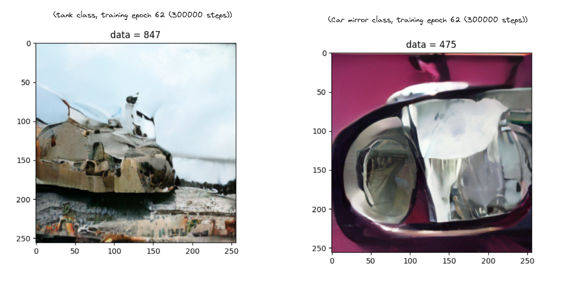
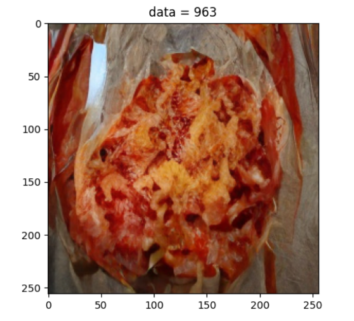
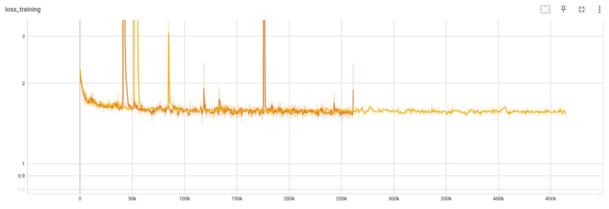

Toy project to do image generation on a low budget GPU (<200h GPU per run)

# MatchingFlowExp

Repo for experiences around matching flow / generative modelling with imagenet

This setup use two things :

- Training with rectified flow setup (aka a better diffusion model) (https://arxiv.org/abs/2209.03003)

- a DiT base architecture (https://github.com/facebookresearch/DiT)

- The training dataset is latent imagenet (https://huggingface.co/datasets/cloneofsimo/imagenet.int8)

### Exemples images

Example of generated images at intermediate training (300k steps) : 

This is using the DiT B-4 (medium) model

Another image using DiT L-4 (longer training) :
 
 (it's pizza !)

Training loss curve :

Some comments here : 

- Some spikes in the training loss are due to the fact that there some images that are only in black and white (anomalies ...)
To be remove

- We have less proper performance than the DiT paper (I discover that every parameters is important ...)

- AutoEncoder matter (vae vs vae sdxl), learning rate matter, architecture (B vs L) obviously matter, dataset matter, sampling technics matter etc

TODO to improve the performances :

- [x] Making the inference sampling with other scheme that euler (done)

- [x] Training with classifier-free guidance for improve inference performance.

Sampling with classifier-free guidance really seems to improve sampling quality

- [ ] Time sampling should be done as in Stable diffusion 3 with lognormal proba

- [ ] We should use muP scaling law to make the training optimal at higher dimension

- [ ] Use torch.compile to accelerate training (I was told it's 10% time improvment)

